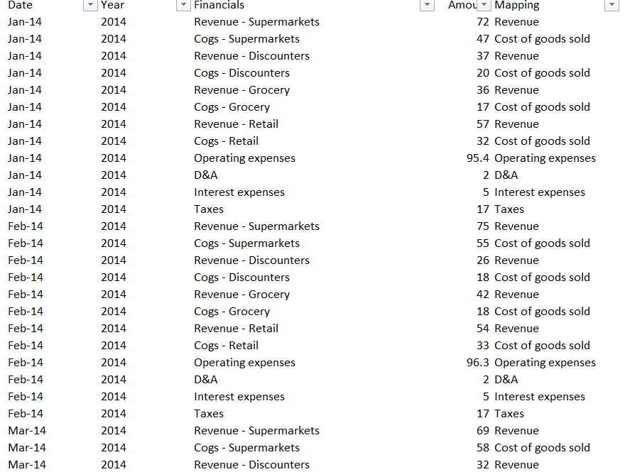
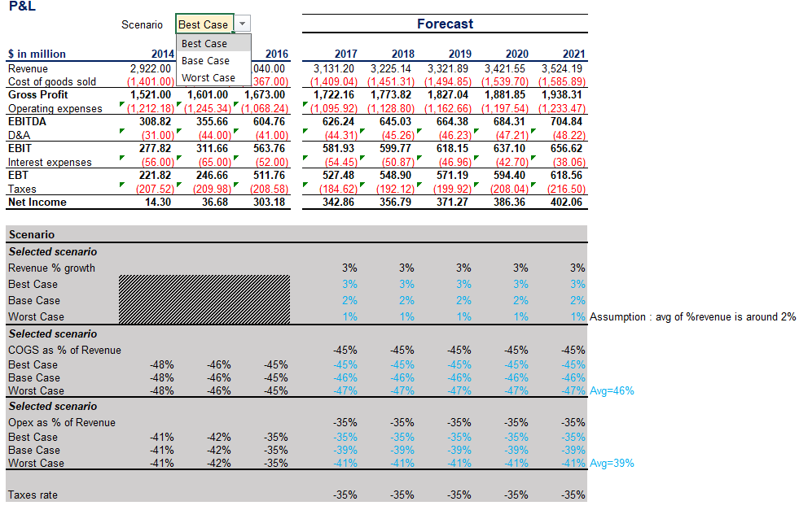
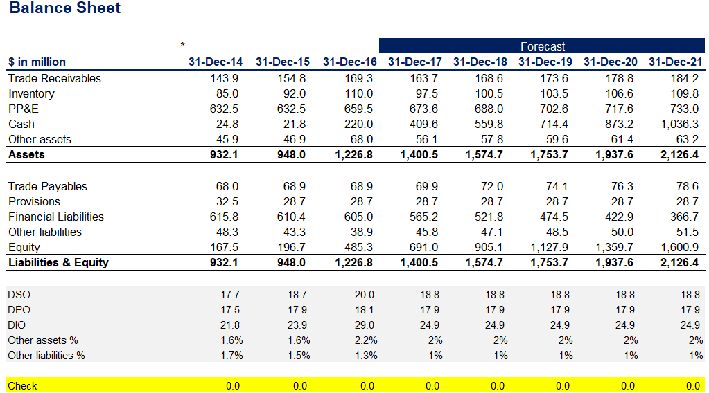
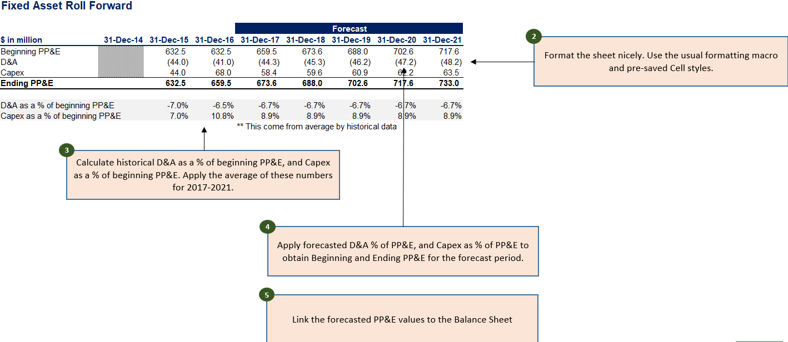
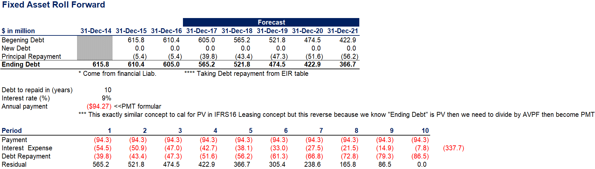
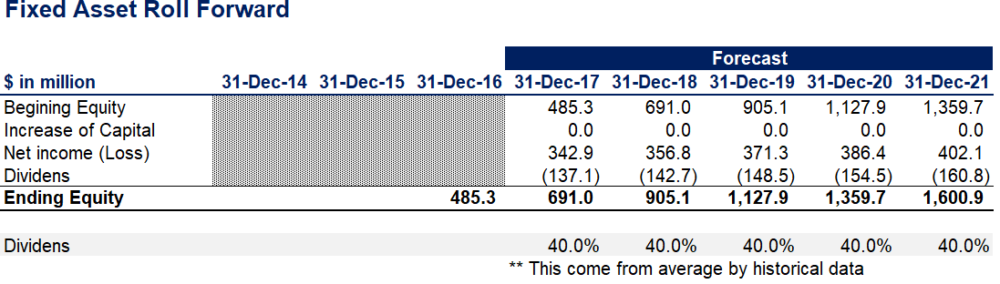
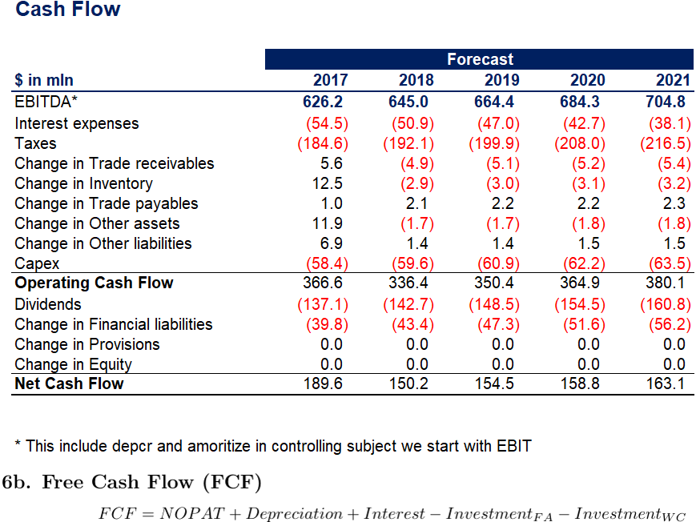

# Financial Statement Build-Up and Forecasting in Excel

This project demonstrates my experience to build up a full financial
statement forecast model in Excel using a combination of **financial &
accounting knowledge** and advanced Excel functions like `SUMIF`,
`XLOOKUP`, and logical structuring. Below I summarize the step-by-step
build aligned with my screenshots.

------------------------------------------------------------------------

## 1. Data Preparation and Mapping

-   **Objective:** Clean raw monthly data (Revenue, COGS, Opex, D&A,
    Interest, Taxes) and map into standardized financial statement
    structure.
-   **Techniques Used:**
    -   `SUMIF` to aggregate line items per mapping code.
    -   Created mapping table (Revenue, Cost of Goods Sold, Opex, etc.).
    -   Consolidated monthly data into quarterly/annual.

**Example:**\
- "Revenue - Supermarkets" → mapped into `Revenue`.\
- "Cogs - Supermarkets" → mapped into `Cost of Goods Sold`.

------------------------------------------------------------------------

## 2. Profit & Loss Forecast

-   Built **P&L forecast 2016--2021** with 3 scenarios: Best, Base,
    Worst.\
-   Assumptions:
    -   Revenue growth: Best = 3%, Base = 2%, Worst = 1%.
    -   COGS % of Revenue: \~45--47% depending on scenario.
    -   Opex % of Revenue: \~35--41% depending on scenario.
    -   Tax rate fixed at -35%.
-   Key calculated items:
    -   **Gross Profit = Revenue -- COGS**
    -   **EBITDA = Gross Profit -- Opex**
    -   **EBIT = EBITDA -- D&A**
    -   **Net Income = EBT -- Taxes**

------------------------------------------------------------------------

## 3. Balance Sheet Forecast

-   Structured Assets & Liabilities forecast.\
-   Main components:
    -   **Assets:** Trade receivables, inventory, PP&E, cash, other
        assets.
    -   **Liabilities & Equity:** Trade payables, provisions, financial
        liabilities, other liabilities, equity.
-   Drivers applied:
    -   Working capital ratios (DSO, DPO, DIO).\
    -   Other assets/liabilities kept constant % of revenue.\
    -   Balancing check (Assets = Liabilities + Equity).

------------------------------------------------------------------------

## 4. Fixed Asset Roll Forward -- PP&E

-   **Objective:** Forecast Capex & D&A to roll forward PP&E.\
-   Method:
    -   Historical D&A % of beginning PP&E calculated (\~6--7%).\
    -   Historical Capex % of beginning PP&E calculated (\~8--9%).\
    -   Applied averages for forecast years.\
-   Linked PP&E ending balance directly into balance sheet.

------------------------------------------------------------------------

## 5. Debt Roll Forward

-   Used **PMT formula logic** to forecast debt repayment.\
-   Input:
    -   Beginning debt from Financial Liabilities.\
    -   Interest rate: 9%.\
    -   Tenor: 10 years.\
    -   Annual Payment = -PMT(rate, nper, PV).
-   Debt schedule created:
    -   Interest expense decreases over time.\
    -   Principal repayment increases.\
    -   Ending balance reconciles with Balance Sheet.

------------------------------------------------------------------------

## 6. Equity Roll Forward

-   Forecasted equity considering:
    -   Beginning equity.\
    -   Net income addition.\
    -   Dividends payout (40% payout ratio).\
    -   Ending equity linked back to balance sheet.

------------------------------------------------------------------------

## 7. Cash Flow Statement

-   Built **Indirect Cash Flow** starting with EBITDA.\
-   Adjusted for:
    -   Interest, taxes.\
    -   Working capital changes (Receivables, Inventory, Payables).\
    -   Other asset/liability changes.\
    -   Capex from PP&E roll forward.\
-   Derived **Operating Cash Flow**, then adjusted for dividends and
    financing activities.

**Free Cash Flow (FCF):**\
\[ FCF = NOPAT + Depreciation + Interest - Investment\_{FA} -
Investment\_{WC} \]

------------------------------------------------------------------------

## Conclusion

This Excel model demonstrates: - Integration of **accounting
principles** (P&L, BS, CF).\
- Usage of **Excel functions** (`SUMIF`, `XLOOKUP`, `PMT`).\
- Scenario analysis (Best/Base/Worst).\
- Financial logic checks (Assets = Liabilities + Equity, cash flow
linkage).

This shows my capability to build a robust **financial forecasting
model** that is both technically structured and business-relevant.
